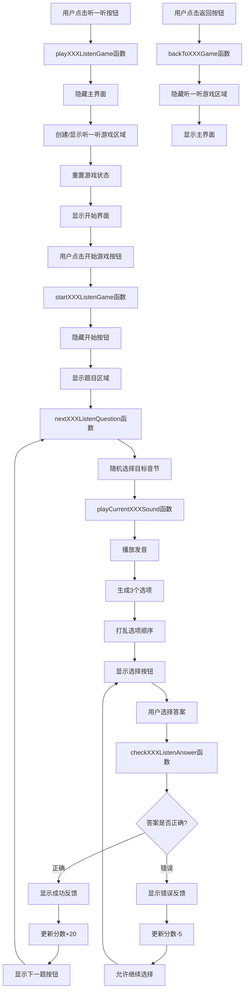

# 拼音小世界

一个适合儿童和初学者的趣味拼音学习网页应用，包含声母、韵母、整体认读、声调、拼读、识字、闯关等多种互动游戏。

## 功能特色

- 声母、韵母、整体认读音节学习与发音
- 声母/韵母/整体认读“听一听”听音辨认游戏
- 声调练习
- 拼读组合游戏
- 识字认读（图文配拼音）
- 闯关测试与成就系统
- 分数与进度自动保存
- 音效与背景音乐控制

## 使用方法

1. 克隆或下载本项目到本地。
2. 使用浏览器直接打开 `index.html` 即可体验全部功能。
3. 推荐使用 VS Code 的 Live Server 插件或命令行静态服务器（如 [serve](https://www.npmjs.com/package/serve)）运行，示例命令：

   ```sh
   npx serve -l 3666 .
   ```

   然后在浏览器访问 [http://localhost:3666](http://localhost:3666)。

## 依赖说明

- 纯前端实现，无需后端。
- 语音播放基于浏览器的 Web Speech API。
- 若需拼音转换功能，请确保引入了 [pinyin-pro](https://github.com/zh-lx/pinyin-pro) 等相关库（如有需要）。

## 目录结构

- `index.html`      主页面
- `main.js`         主要交互逻辑
- `listenjs/initials-listen-game.js`   声母听一听模块
- `listenjs/finals-listen-game.js`     韵母听一听模块
- `listenjs/wholeSyllables-listen-game.js` 整体认读听一听模块
- `README.md`       项目说明

## 功能流程图

### 声母/韵母/整体认读 - 听一听 功能流程



> 其中 XXX 代表 initials、finals、wholeSyllables 三类。

## 贡献与许可

欢迎学习、修改和扩展本项目，仅供学习和非商业用途。
## 贡献与许可

欢迎学习、修改和扩展本项目，仅供学习和非商业用途。
