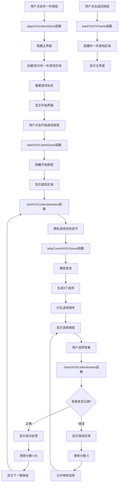

# 拼音小世界

一个适合儿童和初学者的趣味拼音学习网页应用，包含声母、韵母、整体认读、声调、拼读、识字、闯关等多种互动游戏。

## 功能特色

- 声母、韵母、整体认读音节学习与发音
- 声母/韵母/整体认读"听一听"听音辨认游戏
- 声调练习
- 拼读组合游戏
- 识字认读（图文配拼音）
- 闯关测试与成就系统
- 分数与进度自动保存
- 音效与背景音乐控制
- 跨平台语音支持（包括 macOS、iPad、iPhone 等设备）
- 拼音归类游戏

## 使用方法

1. 克隆或下载本项目到本地。
2. 使用浏览器直接打开 `index.html` 即可体验全部功能。
3. 推荐使用 VS Code 的 Live Server 插件或命令行静态服务器（如 [serve](https://www.npmjs.com/package/serve)）运行，示例命令：

   ```sh
   npx serve -l 3666 .
   ```

   然后在浏览器访问 [http://localhost:3666](http://localhost:3666)。

## 依赖说明

- 纯前端实现，无需后端。
- 语音播放基于浏览器的 Web Speech API 和 EasySpeech 库。
- 音频文件使用 mp3 格式存储在 `pinyin-audios` 和 `tone-audios` 目录中。

## 目录结构

```
pinyin/
├── index.html                 # 主页面
├── main.js                    # 主要交互逻辑
├── pinyin-data.js             # 拼音数据定义
├── pinyin.json                # 拼音音频文件映射
├── yindiao.js                 # 声调数据处理
├── yindiao.json               # 声调音频文件映射
├── extended-recognition-data.js # 识字认读扩展数据
├── listenjs/                  # 听一听游戏模块
│   ├── initials-listen-game.js     # 声母听一听模块
│   ├── finals-listen-game.js       # 韵母听一听模块
│   ├── wholeSyllables-listen-game.js # 整体认读听一听模块
│   ├── tone-listen-game.js         # 声调听一听模块
│   └── classification-game.js      # 拼音归类游戏模块
├── pinyin-audios/             # 拼音发音音频文件
├── tone-audios/               # 音效文件
├── pinyin-yindiao-audios/     # 带声调的拼音音频文件
└── README.md                  # 项目说明
```

## 功能模块介绍

### 1. 声母乐园 (initials-game)
学习23个声母的发音，包括 b, p, m, f, d, t, n, l, g, k, h, j, q, x, zh, ch, sh, r, z, c, s, y, w。

### 2. 韵母王国 (finals-game)
学习24个韵母的发音，包括 a, o, e, i, u, ü, ai, ei, ui, ao, ou, iu, ie, üe, er, an, en, in, un, ün, ang, eng, ing, ong。

### 3. 整体认读 (wholeSyllables-game)
学习16个整体认读音节，包括 zhi, chi, shi, ri, zi, ci, si, yi, wu, yu, ye, yue, yuan, yin, yun, ying。

### 4. 声调小屋 (tones-game)
练习四个声调（ˉ, ˊ, ˇ, `）的发音，通过听音选择正确的声调符号。

### 5. 识字认读 (recognition-game)
通过图片与拼音的对应关系，帮助学习者建立汉字与拼音的联系。

### 6. 拼音归类 (classification-game)
通过分类练习，帮助学习者区分声母、韵母和整体认读音节。

## 各类"听一听"游戏功能流程

### 声母/韵母/整体认读 - 听一听 功能流程



> 其中 XXX 代表 initials、finals、wholeSyllables 三类。

## 跨平台兼容性说明

本应用优化了在不同设备上的语音播放体验：

- **macOS**: 使用 Ting-Ting 语音合成
- **iPad/iPhone**: 自动适配设备可用的最佳中文语音
- **Windows**: 优先使用微软中文语音合成服务

## 技术实现细节

### 语音处理
- 使用 EasySpeech 库封装 Web Speech API
- 针对不同平台（特别是苹果设备）优化语音选择逻辑
- 实现了语音播放失败时的回退机制

### 音频播放
- 支持 mp3 音频文件播放
- 实现了音频播放的错误处理机制
- 提供了音效控制（开启/关闭）

### 数据存储
- 使用 localStorage 保存学习进度和分数
- 实现了进度的自动保存和恢复功能

### 用户界面
- 响应式设计，适配不同屏幕尺寸
- 提供了丰富的视觉反馈（按钮点击效果、正确/错误标识等）
- 实现了平滑的动画过渡效果

## 贡献与许可

欢迎学习、修改和扩展本项目，仅供学习和非商业用途。